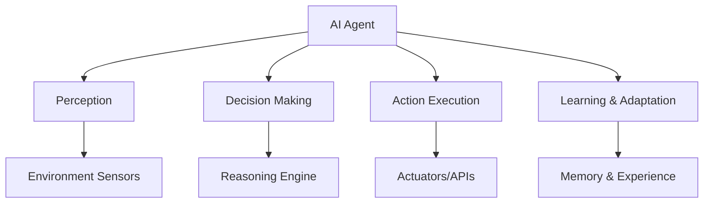

# 🤖 AI Agent: The Future of Autonomous Intelligence

<div align="center">


*Empowering machines to think, learn, and act autonomously*

</div>

---

## 🌟 What is an AI Agent?

An **AI Agent** is an autonomous software entity that perceives its environment, makes decisions, and takes actions to achieve specific goals. Think of it as a digital assistant with the ability to reason, learn, and adapt to changing conditions without constant human supervision.

### 🧠 Core Characteristics



## ✨ Key Features

### 🎯 **Autonomous Operation**
- Self-directed goal pursuit
- Independent problem-solving
- Minimal human intervention required

### 🧪 **Adaptive Learning**
- Continuous improvement from experience
- Pattern recognition and optimization
- Dynamic strategy adjustment

### 🔄 **Multi-Modal Interaction**
- Text, voice, and visual processing
- API integrations and web interactions
- Real-time data processing

### 🛡️ **Robust Architecture**
- Error handling and recovery
- Scalable and maintainable design
- Security-first approach

## 🏗️ Architecture Overview

AI agent follows a modular, event-driven architecture:

```
┌─────────────────┐    ┌─────────────────┐    ┌─────────────────┐
│   Perception    │───▶│   Cognition     │───▶│     Action      │
│     Module      │    │     Engine      │    │    Executor     │
└─────────────────┘    └─────────────────┘    └─────────────────┘
         │                       │                       │
         ▼                       ▼                       ▼
┌─────────────────┐    ┌─────────────────┐    ┌─────────────────┐
│   Environment   │    │     Memory      │    │   Feedback      │
│   Interface     │    │     System      │    │     Loop        │
└─────────────────┘    └─────────────────┘    └─────────────────┘
```

## 🎯 Use Cases

### 💼 Business Applications
- **Customer Service**: 24/7 intelligent support
- **Data Analysis**: Automated insights and reporting
- **Process Automation**: Streamline repetitive tasks

### 🏠 Personal Assistants
- **Smart Home Control**: IoT device management
- **Schedule Management**: Calendar and task optimization
- **Information Retrieval**: Intelligent search and summarization

### 🔬 Research & Development
- **Experimental Design**: Hypothesis generation and testing
- **Literature Review**: Automated research compilation
- **Data Collection**: Web scraping and API monitoring

## 🤝 Contributing

We welcome contributions from the community! Here's how you can help:

### 🐛 Bug Reports
Found a bug? Please create an issue with:
- Clear description of the problem
- Steps to reproduce
- Expected vs actual behavior
- System information

### ✨ Feature Requests
Have an idea? We'd love to hear it:
- Describe the feature and its benefits
- Provide use cases and examples
- Consider implementation complexity

## 📄 License

This project is licensed under the MIT License - see the [LICENSE](LICENSE) file for details.

## 🙏 Acknowledgments

- **OpenAI** for inspiring AI research
- **Users** who provide valuable feedback

---

<div align="center">

**Made with ❤️ by the AI Agent Team**

[⭐ Star this repo](https://github.com/abdul-kabir-jawed/agentic_ai)

*"The best way to predict the future is to create it." - Peter Drucker*

</div>
