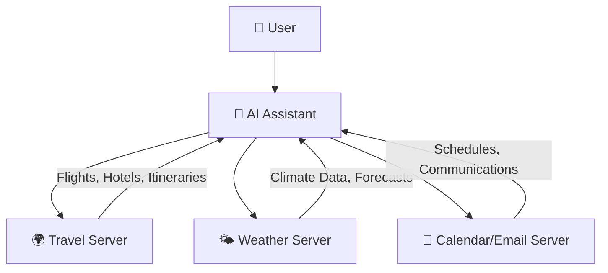
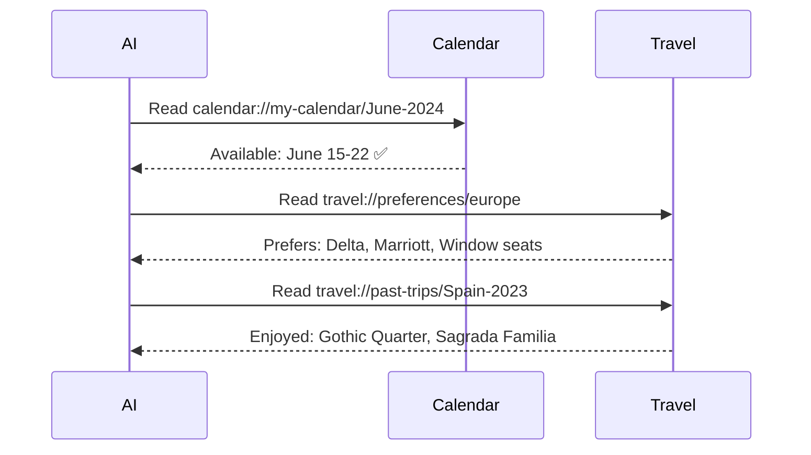
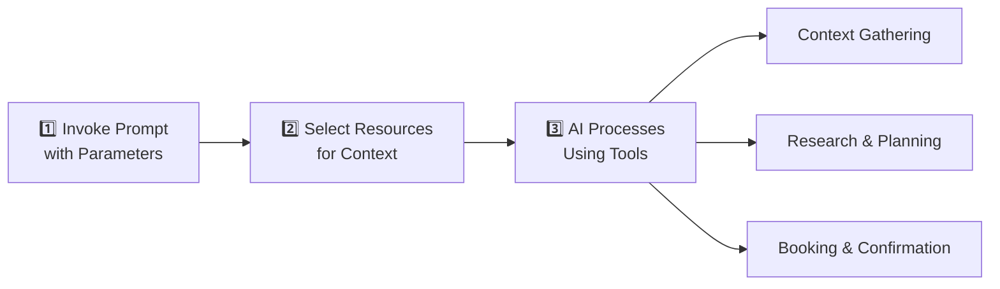
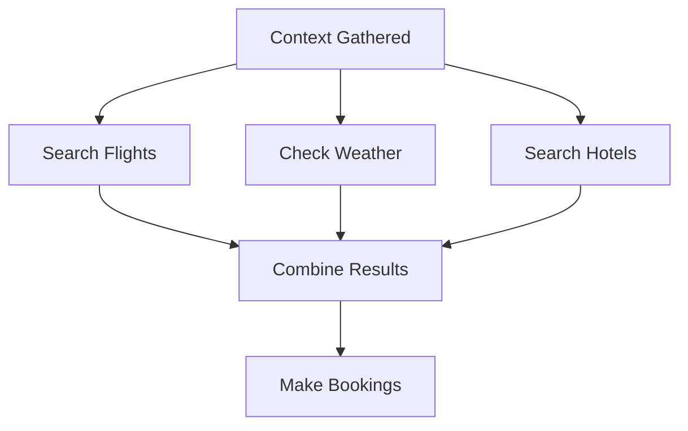
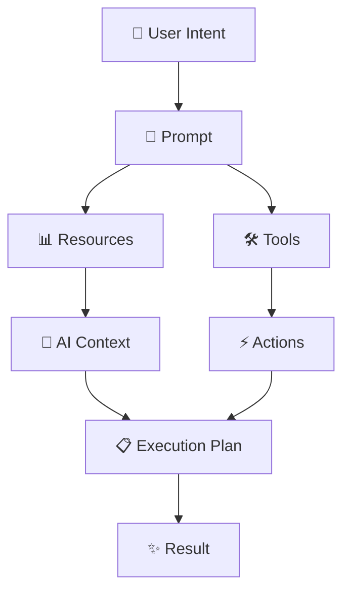

# 🌐 MCP Multi-Server Integration: Complete Guide

> **The real power of MCP emerges when multiple servers work together, combining their specialized capabilities through a unified interface**

---

## 📋 Table of Contents

- [Overview](#overview)
- [Multi-Server Architecture](#multi-server-architecture)
- [Complete Workflow Example](#complete-workflow-example)
- [The Three Stages](#the-three-stages)
- [Benefits of Multi-Server Integration](#benefits-of-multi-server-integration)
- [Implementation Patterns](#implementation-patterns)
- [Best Practices](#best-practices)

---

## 🎯 Overview

### What is Multi-Server Integration?

MCP's **multi-server integration** allows different specialized servers to work together seamlessly, creating powerful workflows that combine:

- 📊 **Resources** from multiple servers
- 🛠️ **Tools** across different domains
- 🎯 **Prompts** that orchestrate complex tasks

### Why Multi-Server?

| Single Server | Multi-Server |
|---------------|--------------|
| Limited to one domain | Multiple specialized domains |
| Isolated capabilities | Integrated workflows |
| Simple tasks | Complex, cross-domain tasks |
| Manual coordination | Automatic orchestration |

---

## 🏗️ Multi-Server Architecture

### Example: AI Travel Planner Application

A comprehensive travel planning system powered by three specialized MCP servers:



---

### Server Responsibilities

#### 1️⃣ Travel Server 🌍

**Purpose:** Manages all travel-related operations

**Capabilities:**
- ✈️ Flight searches and bookings
- 🏨 Hotel reservations
- 📝 Itinerary planning
- 💾 Travel preferences storage
- 📚 Past trip history

**Resources:**
- `travel://preferences/europe` - User's travel preferences
- `travel://past-trips/Spain-2023` - Historical trip data

**Tools:**
- `searchFlights()` - Query airlines for available flights
- `bookHotel()` - Reserve accommodations
- `createItinerary()` - Build travel schedules

---

#### 2️⃣ Weather Server 🌤️

**Purpose:** Provides climate information and forecasts

**Capabilities:**
- 🌡️ Current weather conditions
- 📊 Historical climate data
- 🔮 Weather forecasts
- 🌍 Regional climate patterns

**Tools:**
- `checkWeather()` - Retrieve forecasts for specific dates
- `getClimateData()` - Historical weather patterns
- `getSeasonalInfo()` - Best times to visit

---

#### 3️⃣ Calendar/Email Server 📅

**Purpose:** Manages schedules and communications

**Capabilities:**
- 📆 Calendar management
- ✉️ Email sending
- ⏰ Event scheduling
- 🔔 Reminder management

**Resources:**
- `calendar://my-calendar/June-2024` - User's availability

**Tools:**
- `createCalendarEvent()` - Add events to calendar
- `sendEmail()` - Send communications
- `checkAvailability()` - Verify schedule conflicts

---

## 🔄 Complete Workflow Example

### Real-World Scenario: Planning a Barcelona Vacation

Let's walk through a complete multi-server workflow from start to finish.

---

### Stage 1: User Invokes Prompt with Parameters

The user starts by selecting a prompt and providing essential information:

```json
{
  "prompt": "plan-vacation",
  "arguments": {
    "destination": "Barcelona",
    "departure_date": "2024-06-15",
    "return_date": "2024-06-22",
    "budget": 3000,
    "travelers": 2
  }
}
```

#### Prompt Parameters Explained

| Parameter | Value | Purpose |
|-----------|-------|---------|
| `destination` | `"Barcelona"` | Target city for the trip |
| `departure_date` | `"2024-06-15"` | When the trip begins |
| `return_date` | `"2024-06-22"` | When the trip ends |
| `budget` | `3000` | Maximum spending limit (USD) |
| `travelers` | `2` | Number of people traveling |

---

### Stage 2: User Selects Resources to Include

The AI needs context to make informed decisions. The user selects relevant resources:

#### Selected Resources

```
📅 calendar://my-calendar/June-2024
   └─ From: Calendar Server
   └─ Contains: User's availability and existing commitments

🌍 travel://preferences/europe
   └─ From: Travel Server
   └─ Contains: Preferred airlines, hotel types, seating preferences

📚 travel://past-trips/Spain-2023
   └─ From: Travel Server
   └─ Contains: Previously enjoyed locations and activities
```

#### Why These Resources Matter

| Resource | Information Provided | Impact on Planning |
|----------|---------------------|-------------------|
| **Calendar** | Available dates, conflicts | Ensures trip doesn't clash with commitments |
| **Preferences** | Airlines, hotels, amenities | Personalizes bookings to user's taste |
| **Past Trips** | Liked locations, activities | Recommends similar experiences |

---

### Stage 3: AI Processes Request Using Tools

The AI orchestrates a complex workflow across multiple servers.

#### Phase 1: Context Gathering 🔍

The AI **reads** all selected resources to build comprehensive context:



**Insights Gathered:**
- ✅ June 15-22 is available (no conflicts)
- 🎫 User prefers Delta airlines and window seats
- 🏨 User likes Marriott-brand hotels
- 🗺️ User enjoyed Gothic Quarter and Sagrada Familia previously

---

#### Phase 2: Research & Planning 📊

The AI uses tools to gather real-time information:

**1. Search Flights**

```python
searchFlights({
  "origin": "NYC",
  "destination": "Barcelona",
  "departure": "2024-06-15",
  "return": "2024-06-22",
  "travelers": 2,
  "maxPrice": 1500,  # Half of budget
  "preferredAirlines": ["Delta"]
})
```

**Result:** Found Delta flight for $1,400 total (both travelers)

---

**2. Check Weather**

```python
checkWeather({
  "location": "Barcelona",
  "startDate": "2024-06-15",
  "endDate": "2024-06-22"
})
```

**Result:** Sunny, 75-82°F, perfect weather for sightseeing

---

**3. Search Hotels**

```python
bookHotel({
  "location": "Barcelona",
  "checkIn": "2024-06-15",
  "checkOut": "2024-06-22",
  "guests": 2,
  "maxPrice": 1200,  # Remaining budget
  "preferredChains": ["Marriott"],
  "nearbyAttractions": ["Gothic Quarter", "Sagrada Familia"]
})
```

**Result:** Found Marriott near Gothic Quarter for $1,100

---

#### Phase 3: Booking & Confirmation 🎫

The AI requests user approval and executes bookings:

**4. Create Calendar Event**

```python
createCalendarEvent({
  "calendar": "my-calendar",
  "title": "Barcelona Vacation",
  "startDate": "2024-06-15",
  "endDate": "2024-06-22",
  "description": "Trip to Barcelona - Delta flights, Marriott hotel",
  "reminders": [
    {"type": "notification", "time": "1 week before"}
  ]
})
```

**Result:** Event added to calendar with reminders

---

**5. Send Confirmation Email**

```python
sendEmail({
  "to": "user@example.com",
  "subject": "Your Barcelona Trip Confirmation",
  "body": {
    "flights": "Delta - NYC to Barcelona, June 15-22",
    "hotel": "Marriott Barcelona, Gothic Quarter area",
    "total_cost": "$2,500 (within budget)",
    "weather": "Sunny, 75-82°F",
    "itinerary_link": "travel://itineraries/barcelona-2024"
  },
  "attachments": ["boarding_passes.pdf", "hotel_confirmation.pdf"]
})
```

**Result:** Confirmation email sent with all trip details

---

## 📊 The Three Stages

### Visual Summary



---

### Stage-by-Stage Breakdown

| Stage | Actor | Action | Output |
|-------|-------|--------|--------|
| **1. Prompt Invocation** | User | Provides destination, dates, budget | Structured request |
| **2. Resource Selection** | User | Chooses relevant context sources | Contextual data |
| **3a. Context Gathering** | AI | Reads resources across servers | Comprehensive understanding |
| **3b. Research** | AI | Executes search tools | Real-time options |
| **3c. Booking** | AI | Creates events, sends confirmations | Completed trip |

---

## 🎁 Benefits of Multi-Server Integration

### Time Savings ⏱️

| Traditional Approach | MCP Multi-Server Approach |
|---------------------|---------------------------|
| ⏰ **Hours of work** | ⏱️ **Minutes of work** |
| Multiple websites | Single interface |
| Manual context switching | Automatic coordination |
| Repeated data entry | Context reuse |
| Email confirmations scattered | Centralized communication |

---

### Enhanced Capabilities 🚀

**1. Cross-Domain Intelligence**

The AI combines information from multiple domains:
- 📅 Calendar availability
- 🌍 Travel preferences
- 🌤️ Weather forecasts
- 💰 Budget constraints

**2. Contextual Awareness**

Past trips inform future planning:
- "You enjoyed Gothic Quarter before" → Book nearby hotel
- "You prefer window seats" → Filter flight options
- "You like Marriott" → Prioritize chain hotels

**3. Automated Workflows**

One prompt triggers multi-step processes:
- Search flights
- Check weather
- Book accommodations
- Update calendar
- Send confirmations

**4. Unified Experience**

Single interface for multiple services:
- No app switching
- Consistent interactions
- Shared context

---

## 🛠️ Implementation Patterns

### Pattern 1: Sequential Processing

Execute tools in a specific order:

```
1. Gather Context (Read Resources)
   ↓
2. Research Options (Search Tools)
   ↓
3. Make Decisions (Compare & Filter)
   ↓
4. Execute Actions (Booking Tools)
   ↓
5. Confirm & Notify (Communication Tools)
```

---

### Pattern 2: Parallel Processing

Execute independent operations simultaneously:



---

### Pattern 3: Conditional Logic

Adapt workflow based on results:

```python
if budget_remaining > hotel_cost:
    book_hotel()
    add_activities()
else:
    find_cheaper_hotel()
    reduce_activities()

if weather_forecast == "rainy":
    suggest_indoor_attractions()
else:
    suggest_outdoor_attractions()
```

---

## ✅ Best Practices

### For Server Developers

#### 1. Clear Server Boundaries 🎯

Each server should have a **well-defined responsibility**:

- ✅ **Good:** Weather Server handles only climate data
- ❌ **Bad:** Weather Server also books flights

#### 2. Consistent Resource URIs 🔗

Use predictable, hierarchical naming:

```
travel://preferences/[region]
travel://past-trips/[trip-id]
calendar://[calendar-name]/[period]
```

#### 3. Robust Error Handling 🚨

Plan for failures across servers:

```python
try:
    flight = searchFlights(params)
except FlightNotFoundError:
    notify_user("No flights found in budget")
    suggest_alternatives()
```

#### 4. Efficient Resource Access 📊

Minimize redundant reads:

```python
# ✅ Good: Read once, use multiple times
preferences = read_resource("travel://preferences/europe")
filter_flights(preferences)
filter_hotels(preferences)

# ❌ Bad: Read multiple times
filter_flights(read_resource("travel://preferences/europe"))
filter_hotels(read_resource("travel://preferences/europe"))
```

---

### For AI Implementations

#### 1. Context-First Approach 🔍

Always gather context before taking action:

```
Read Resources → Understand Context → Execute Tools
```

#### 2. User Confirmation for High-Stakes Actions 👤

Request approval before:
- 💰 Spending money
- 📧 Sending external communications
- 🗑️ Deleting data
- 🔒 Changing security settings

#### 3. Progress Communication 📢

Keep users informed during long workflows:

```
✅ Searching flights...
✅ Flights found! Checking weather...
✅ Weather looks great! Finding hotels...
✅ Hotel options found! Ready to book?
```

#### 4. Graceful Degradation 🛡️

Continue when servers are unavailable:

```python
try:
    weather = checkWeather(location, dates)
except WeatherServerOffline:
    weather = "Weather data unavailable"
    # Continue with booking anyway
```

---

### For Application Designers

#### 1. Transparent Server Usage 👁️

Show users which servers are involved:

```
🌍 Using Travel Server for flights
🌤️ Using Weather Server for forecasts
📅 Using Calendar Server for scheduling
```

#### 2. Resource Selection UI 🎨

Make it easy to choose relevant resources:

- 📋 Show resource previews
- 🏷️ Group by server/category
- 🔍 Enable searching
- ⭐ Suggest frequently used resources

#### 3. Tool Execution Visibility ⚡

Display tool calls in real-time:

```
Running: searchFlights(origin: "NYC", destination: "Barcelona")
Running: checkWeather(location: "Barcelona", dates: "June 15-22")
Running: bookHotel(location: "Barcelona", budget: 1200)
```

---

## 🎓 Key Takeaways

### The Power Trio

Multi-server MCP combines three powerful primitives:

| Primitive | Role | Example |
|-----------|------|---------|
| **Prompts** | Orchestrate workflows | "plan-vacation" prompt |
| **Resources** | Provide context | Calendar, preferences, history |
| **Tools** | Execute actions | Search, book, notify |

---

### The Complete Picture



---

### Success Metrics

A well-designed multi-server system delivers:

- ⏱️ **Time Efficiency:** Tasks that took hours now take minutes
- 🎯 **Accuracy:** AI has full context for better decisions
- 🔄 **Automation:** Complex workflows execute automatically
- 😊 **User Experience:** Single interface, multiple capabilities
- 🔗 **Integration:** Seamless coordination across domains

---

## 💡 Real-World Impact

### Before MCP Multi-Server

```
User opens browser → Searches flights → Opens new tab
→ Checks calendar → Switches tab → Books flight
→ Opens weather app → Checks forecast
→ Opens hotel site → Searches hotels → Books hotel
→ Updates calendar manually → Emails self confirmation
⏰ Time: 2-3 hours
```

### After MCP Multi-Server

```
User: "Plan a vacation to Barcelona, June 15-22, $3000 budget"
AI: [Automatically coordinates across servers]
⏰ Time: 5 minutes
```

---

<div align="center">

## 🌟 The Future of AI Integration

**MCP Multi-Server Integration transforms specialized servers into a unified, intelligent system**

*One interface. Multiple capabilities. Infinite possibilities.*

</div>

---

<div align="center">

**Built with MCP (Model Context Protocol)**

*Empowering cross-domain AI workflows*

</div>
