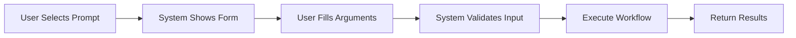

# 🎯 MCP Prompts: Complete Guide

> **Reusable, parameterized templates that structure interactions between users and AI models**

---

## 📋 Table of Contents

- [Overview](#overview)
- [Core Concepts](#core-concepts)
- [Protocol Operations](#protocol-operations)
- [Server-Side Implementation](#server-side-implementation)
- [Prompt Arguments](#prompt-arguments)
- [User Interaction Patterns](#user-interaction-patterns)
- [Best Practices](#best-practices)
- [Key Principles](#key-principles)

---

## 🌟 Overview

**Prompts in MCP (Model Context Protocol)** are powerful tools that enable structured, repeatable workflows. They allow MCP server authors to:

- 📝 Provide domain-specific templates
- 🎨 Showcase best practices for server usage
- 🔄 Create consistent interaction patterns
- ⚡ Streamline common workflows

### Why Use Prompts?

Instead of unstructured natural language input, prompts enable:

1. **Selection** of predefined templates
2. **Structured input** with validated parameters
3. **Consistent execution** based on the template
4. **Reusable workflows** across different contexts

---

## 💡 Core Concepts

### What Are Prompts?

| Feature | Description |
|---------|-------------|
| **Structured Templates** | Define expected inputs and interaction patterns |
| **User-Controlled** | Require explicit invocation, never auto-triggered |
| **Context-Aware** | Can reference available resources and tools |
| **Parameterized** | Accept arguments to customize behavior |
| **Discoverable** | Support parameter completion for valid values |

---

## 🔌 Protocol Operations

### 1️⃣ `prompts/list` - Discover Available Prompts

**Purpose:** Retrieve all available prompts on the server

#### Client Implementation

```python
async def list_prompts(self, cursor: str | None = None) -> types.ListPromptsResult:
    """Send a prompts/list request."""
    return await self.send_request(
        types.ClientRequest(
            types.ListPromptsRequest(
                method="prompts/list",
                params=types.PaginatedRequestParams(cursor=cursor) if cursor is not None else None,
            )
        ),
        types.ListPromptsResult,
    )
```

#### Parameters

| Parameter | Type | Required | Description |
|-----------|------|----------|-------------|
| `cursor` | `str \| None` | ❌ No | Pagination token for retrieving additional results |

#### Returns

Array of prompt descriptors containing:

- `name` - Unique identifier for the prompt
- `title` - Human-readable display name
- `description` - Explanation of the prompt's purpose
- `arguments` - List of parameters the prompt accepts

---

### 2️⃣ `prompts/get` - Retrieve Prompt Details

**Purpose:** Get the full definition and rendered content of a specific prompt

#### Client Implementation

```python
async def get_prompt(self, name: str, arguments: dict[str, str] | None = None) -> types.GetPromptResult:
    """Send a prompts/get request."""
    return await self.send_request(
        types.ClientRequest(
            types.GetPromptRequest(
                method="prompts/get",
                params=types.GetPromptRequestParams(name=name, arguments=arguments),
            )
        ),
        types.GetPromptResult,
    )
```

#### Parameters

| Parameter | Type | Required | Description |
|-----------|------|----------|-------------|
| `name` | `str` | ✅ Yes | The unique identifier of the prompt to retrieve |
| `arguments` | `dict[str, str] \| None` | ❌ No | Dictionary of argument values to render the prompt |

#### Returns

Full prompt definition including:

- `description` - Detailed explanation of what the prompt does
- `messages` - Rendered message array ready for model consumption

---

### 3️⃣ `completion/complete` - Argument Autocompletion

**Purpose:** Get argument suggestions and autocompletion for prompt parameters

#### Client Implementation

```python
async def complete(
    self,
    ref: types.ResourceTemplateReference | types.PromptReference,
    argument: dict[str, str],
    context_arguments: dict[str, str] | None = None,
) -> types.CompleteResult:
    """Send a completion/complete request."""
    context = None
    if context_arguments is not None:
        context = types.CompletionContext(arguments=context_arguments)

    return await self.send_request(
        types.ClientRequest(
            types.CompleteRequest(
                method="completion/complete",
                params=types.CompleteRequestParams(
                    ref=ref,
                    argument=types.CompletionArgument(**argument),
                    context=context,
                )
            )
        ),
        types.CompleteResult,
    )
```

#### Parameters

| Parameter | Type | Required | Description |
|-----------|------|----------|-------------|
| `ref` | `ResourceTemplateReference \| PromptReference` | ✅ Yes | Reference to the prompt or resource template |
| `argument` | `dict[str, str]` | ✅ Yes | The argument being completed (name and partial value) |
| `context_arguments` | `dict[str, str] \| None` | ❌ No | Additional context for smarter completions |

#### Returns

Suggested values for the argument being completed

---

## 🛠️ Server-Side Implementation

### Registering Prompts

#### Using the Decorator Pattern

```python
@server.prompt(
    name="analyze_table",
    title="Analyze Database Table", 
    description="Provides schema analysis for a database table"
)
def analyze_table(table_name: str) -> list[Message]:
    """
    Analyzes a database table schema.
    
    Args:
        table_name: Name of the table to analyze
    """
    schema = read_table_schema(table_name)
    return [
        {
            "role": "user",
            "content": f"Analyze this schema:\n{schema}"
        }
    ]
```

#### Decorator Parameters

| Parameter | Type | Required | Description |
|-----------|------|----------|-------------|
| `name` | `str \| None` | ❌ No | Unique identifier (defaults to function name) |
| `title` | `str \| None` | ❌ No | Human-readable display name |
| `description` | `str \| None` | ❌ No | Explanation of the prompt's purpose |

> ⚠️ **Important:** Always call the decorator with parentheses: `@prompt()` not `@prompt`

---

#### Async Prompts

```python
@server.prompt()
async def analyze_file(path: str) -> list[Message]:
    """
    Analyzes file contents.
    
    Args:
        path: File system path to analyze
    """
    content = await read_file(path)
    return [
        {
            "role": "user",
            "content": {
                "type": "resource",
                "resource": {
                    "uri": f"file://{path}",
                    "text": content
                }
            }
        }
    ]
```

---

#### Direct Registration

```python
def add_prompt(self, prompt: Prompt) -> None:
    """
    Add a prompt to the server programmatically.
    
    Args:
        prompt: A Prompt instance to add
    """
    self._prompt_manager.add_prompt(prompt)
```

---

### Handling Prompt Requests

#### Listing Prompts

```python
async def list_prompts(self) -> list[MCPPrompt]:
    """List all available prompts."""
    prompts = self._prompt_manager.list_prompts()
    return [
        MCPPrompt(
            name=prompt.name,
            title=prompt.title,
            description=prompt.description,
            arguments=[
                MCPPromptArgument(
                    name=arg.name,
                    description=arg.description,
                    required=arg.required,
                )
                for arg in (prompt.arguments or [])
            ],
        )
        for prompt in prompts
    ]
```

#### Getting a Specific Prompt

```python
async def get_prompt(self, name: str, arguments: dict[str, Any] | None = None) -> GetPromptResult:
    """Get a prompt by name with arguments."""
    try:
        prompt = self._prompt_manager.get_prompt(name)
        if not prompt:
            raise ValueError(f"Unknown prompt: {name}")

        messages = await prompt.render(arguments)

        return GetPromptResult(
            description=prompt.description,
            messages=pydantic_core.to_jsonable_python(messages),
        )
    except Exception as e:
        logger.exception(f"Error getting prompt {name}")
        raise ValueError(str(e))
```

---

## 📝 Prompt Arguments

### Argument Structure

```python
MCPPromptArgument(
    name="destination",           # Argument identifier
    description="Travel destination city",  # User-facing explanation
    required=True                 # Whether the argument is mandatory
)
```

### Supported Argument Types

| Type | Description | Example |
|------|-------------|---------|
| **String** | Text values | `"Barcelona"` |
| **Number** | Numeric values | `7`, `3000` |
| **Boolean** | True/false values | `true`, `false` |
| **Array** | Lists of values | `["beaches", "architecture", "food"]` |

---

### Example: Travel Planning Prompt

```json
{
  "name": "plan-vacation",
  "title": "Plan a vacation",
  "description": "Guide through vacation planning process",
  "arguments": [
    { 
      "name": "destination", 
      "type": "string", 
      "required": true,
      "description": "City or country to visit"
    },
    { 
      "name": "duration", 
      "type": "number",
      "required": true,
      "description": "Length of stay in days"
    },
    { 
      "name": "budget", 
      "type": "number", 
      "required": false,
      "description": "Total budget in USD"
    },
    { 
      "name": "interests", 
      "type": "array",
      "required": false,
      "items": { "type": "string" },
      "description": "Activities and attractions of interest"
    }
  ]
}
```

---

## 🎨 User Interaction Patterns

### Discovery Methods

| Method | Description | Example |
|--------|-------------|---------|
| **Slash Commands** | Type `/` to see available prompts | `/plan-vacation` |
| **Command Palettes** | Searchable prompt browser | `Ctrl+P`, `Cmd+K` |
| **UI Buttons** | Dedicated buttons for common prompts | "Plan Vacation" button |
| **Context Menus** | Right-click suggestions based on context | Context-aware prompt list |

---

### Workflow Example



#### Step-by-Step Flow

1. **User:** Selects "Plan a vacation" prompt
2. **System:** Presents structured input form
3. **User:** Fills in:
   - Destination: `"Barcelona"`
   - Duration: `7` days
   - Budget: `$3000`
   - Interests: `["beaches", "architecture", "food"]`
4. **System:** Executes consistent workflow based on template
5. **Result:** Structured vacation plan tailored to inputs

---

## ✅ Best Practices

### For Server Authors

- ✨ **Clear Naming** - Use descriptive names and titles
- 📖 **Comprehensive Descriptions** - Explain what the prompt does and when to use it
- 🔍 **Validate Arguments** - Check required parameters and types
- 🚨 **Error Handling** - Provide helpful error messages for invalid inputs
- 📚 **Document Parameters** - Describe each argument's purpose and format

### For Client Applications

- 🔎 **Intuitive Discovery** - Make prompts easy to find and browse
- ✔️ **Argument Validation** - Validate inputs before sending requests
- 💬 **Show Descriptions** - Display prompt and argument descriptions to users
- 🤖 **Smart Completion** - Use the completion API for argument suggestions
- 👁️ **Transparent Templates** - Let users see and understand the underlying prompt

---

## 🎯 Key Principles

| Principle | Description |
|-----------|-------------|
| **User-Controlled** | Prompts are never auto-invoked; users explicitly select them |
| **Structured Over Unstructured** | Replace free-form input with guided workflows |
| **Reusable** | Define once, use many times with different arguments |
| **Context-Aware** | Can reference resources, tools, and environment state |
| **Discoverable** | Support exploration and autocompletion |

---

## 🎓 Summary

MCP Prompts transform unstructured interactions into **structured, repeatable workflows**. They enable:

- ✅ **Consistency** - Same template, predictable results
- 🔍 **Discoverability** - Easy to find and understand available capabilities
- 🔧 **Flexibility** - Parameterized for different use cases
- 🏆 **Best Practices** - Server authors encode domain expertise into templates
- 😊 **Better UX** - Guided input instead of guessing what to ask

---

<div align="center">

**Built with MCP (Model Context Protocol)**

*Empowering structured AI interactions*

</div>
