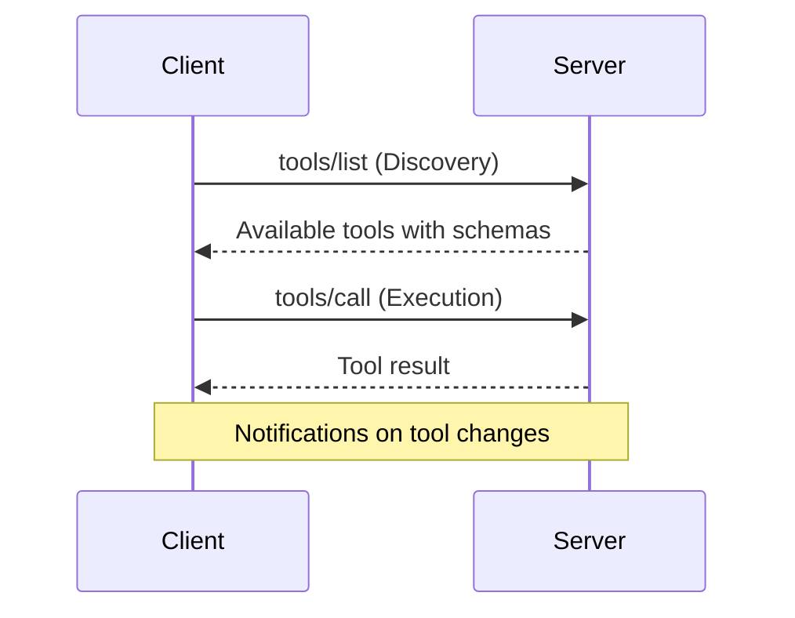

# 🛠️ MCP Tools - Complete Guide

## 📖 Overview

**Tools** in the Model Context Protocol (MCP) enable AI models to perform actions beyond text generation. They provide a standardized way for models to interact with external systems, execute operations, and manipulate data through well-defined interfaces.

> 💡 **Key Concept**: Tools are schema-defined interfaces that LLMs can invoke to perform specific operations with clearly defined inputs and outputs.

---

## 🔄 How Tools Work

### Core Principles

Tools operate on a **discovery and execution** model:

1. **🔍 Discovery Phase**: The MCP client requests available tools
2. **⚡ Execution Phase**: The client invokes specific tools with parameters
3. **🛡️ Error Handling**: Automatic error conversion and user-friendly messages



### Protocol Operations

| Method | Purpose | Returns |
|--------|---------|---------|
| `tools/list` | Discover available tools | Array of tool definitions with schemas |
| `tools/call` | Execute a specific tool | Tool execution result |

---

## 🚀 Creating Tools with FastMCP

### Using the `@mcp.tool` Decorator

The FastMCP Python SDK makes tool creation incredibly simple using decorators:

```python
@mcp.tool(
    name="search_flights",
    title="Flight Search Engine",
    description="Search for available flights between cities"
)
def search_flights(
    origin: str = Field(description="Departure city"),
    destination: str = Field(description="Arrival city"), 
    date: str = Field(description="Travel date (YYYY-MM-DD)")
) -> str:
    # Your implementation here
    return f"Found flights from {origin} to {destination} on {date}"
```

### Key Features

- ✅ **Automatic Schema Generation**: Uses Python type hints and Pydantic Fields
- ✅ **Error Handling**: Python exceptions automatically convert to MCP errors
- ✅ **Type Safety**: Full type checking and validation
- ✅ **Documentation**: Descriptions become part of the tool schema

---

## 📋 Tool Registration Methods

### Method 1: Decorator Pattern

```python
@server.tool()
def my_tool(x: int) -> str:
    return str(x)
```

### Method 2: Programmatic Registration

```python
def my_function(x: int) -> str:
    return str(x)

server.add_tool(
    my_function,
    name="custom_name",
    title="Custom Tool",
    description="Does something useful"
)
```

### Method 3: With Context Access

```python
@server.tool()
def tool_with_context(x: int, ctx: Context) -> str:
    ctx.info(f"Processing {x}")
    return str(x)
```

---

## 🌐 Protocol Communication

### Listing Tools Request

```json
{
  "jsonrpc": "2.0",
  "id": 1,
  "method": "tools/list",
  "params": {
    "cursor": "optional-cursor-value"
  }
}
```

### Listing Tools Response

```json
{
  "jsonrpc": "2.0",
  "id": 1,
  "result": {
    "tools": [
      {
        "name": "search_flights",
        "title": "Flight Search Engine",
        "description": "Search for available flights",
        "inputSchema": {
          "type": "object",
          "properties": {
            "origin": {
              "type": "string",
              "description": "Departure city"
            },
            "destination": {
              "type": "string", 
              "description": "Arrival city"
            },
            "date": {
              "type": "string",
              "format": "date",
              "description": "Travel date"
            }
          },
          "required": ["origin", "destination", "date"]
        }
      }
    ],
    "nextCursor": "next-page-cursor"
  }
}
```

### Tool Execution Request

```json
{
  "jsonrpc": "2.0",
  "id": 2,
  "method": "tools/call",
  "params": {
    "name": "search_flights",
    "arguments": {
      "origin": "NYC",
      "destination": "Barcelona", 
      "date": "2024-06-15"
    }
  }
}
```

### Tool Execution Response

```json
{
  "jsonrpc": "2.0",
  "id": 2,
  "result": {
    "content": [
      {
        "type": "text",
        "text": "Found 3 flights from NYC to Barcelona on 2024-06-15..."
      }
    ],
    "isError": false
  }
}
```

---

## 🎯 Practical Example: Document Management

### Document Reader Tool

```python
@mcp.tool(
    name="read_document",
    description="Read the contents of a document by ID"
)
def read_document(
    doc_id: str = Field(description="ID of the document to read")
) -> str:
    if doc_id not in documents:
        raise ValueError(f"Document with ID {doc_id} not found")
    return documents[doc_id]
```

### Document Editor Tool

```python
@mcp.tool(
    name="edit_document", 
    description="Edit document by replacing text"
)
def edit_document(
    doc_id: str = Field(description="Document ID to edit"),
    old_text: str = Field(description="Text to replace (exact match)"),
    new_text: str = Field(description="Replacement text")
) -> str:
    if doc_id not in documents:
        raise ValueError(f"Document with ID {doc_id} not found")
    
    documents[doc_id] = documents[doc_id].replace(old_text, new_text)
    return f"Successfully updated document {doc_id}"
```

---

## 🔧 Tool Parameter Breakdown

When creating MCP tools, you have several parameters that control behavior and metadata:

```python
@server.tool(
    name: str | None = None,
    title: str | None = None, 
    description: str | None = None,
    annotations: ToolAnnotations | None = None,
    structured_output: bool | None = None
)
def my_tool(...):
    pass
```

### Parameter Details

| Parameter | Type | Purpose | Default Behavior |
|-----------|------|---------|------------------|
| `name` | `str \| None` | Unique tool identifier used by AI models | Auto-generated from function name |
| `title` | `str \| None` | Human-readable display name | Uses the function name |
| `description` | `str \| None` | Detailed explanation of tool's purpose | Extracted from function docstring |
| `annotations` | `ToolAnnotations \| None` | Metadata for tool behavior control | No special behaviors |
| `structured_output` | `bool \| None` | Output format preference | Auto-detected from return type |

---

## 📊 Structured vs Unstructured Output

### What It Is

**Structured Output**: Validated data objects with defined schemas (JSON, Pydantic models)
**Unstructured Output**: Free-form text or content without strict validation

### When to Use Each

```python
# ✅ Structured - Machine-readable data processing
@server.tool(structured_output=True)
def get_flight_info(flight_id: str) -> FlightData:
    return FlightData(
        flight_number="AA123",
        departure="NYC",
        arrival="LAX",
        price=299.99
    )

# ✅ Unstructured - Human-readable narratives  
@server.tool(structured_output=False)
def generate_travel_summary(trip_data: dict) -> str:
    return f"Your trip to {trip_data['destination']} includes 3 flights with a total cost of ${trip_data['total_cost']}. Weather looks great!"
```

### Why It Matters

- **🤖 AI Processing**: Models can directly parse structured data for calculations and logic
- **👥 Human Reading**: Unstructured text provides natural, contextual information
- **🔄 Integration**: Structured output enables seamless data flow between tools

```python
# Example: Structured output feeding into another tool
flight_data = get_flight_info("AA123")  # Returns structured FlightData
summary = generate_itinerary(flight_data)  # Can process the structured data
```

---

## 🏷️ Tool Annotations

### What It Is

Metadata tags that provide the MCP system with instructions on how to handle your tool:

```python
from fastmcp import ToolAnnotations

@server.tool(
    annotations=ToolAnnotations(
        category="data_management",           # Organization
        requires_approval=True,               # Safety control
        danger_level="medium",                # Risk assessment
        performance_hint="slow",              # Execution expectation
        access_level="admin",                 # Permission requirement
        rate_limit=10,                        # Usage throttling
        tags=["file", "delete", "admin"]      # Searchable labels
    )
)
def delete_user_data(user_id: str) -> str:
    # Destructive operation requiring careful handling
    pass
```

### Specific Benefits

**📂 Categorization**
```python
# Groups related tools together in UI
annotations=ToolAnnotations(category="file_operations")
```

**🛡️ Safety Controls**
```python
# Prompts user before execution
annotations=ToolAnnotations(requires_approval=True, danger_level="high")
```

**⚡ Performance Hints**
```python
# Warns UI about expected execution time
annotations=ToolAnnotations(performance_hint="slow")
```

**🔐 Access Controls**
```python
# Restricts tool to specific user roles
annotations=ToolAnnotations(access_level="admin")
```

### Real-World Analogy

Think of annotations like **warning labels on tools**:
- 🔨 A hammer might be labeled "Heavy Duty" (category) and "Requires Safety Gear" (requires_approval)
- 🪚 A chainsaw would have "Dangerous" (danger_level="high") and "Professional Use Only" (access_level="expert")

---

## ⚡ Async Tool Support

### What It Is

Non-blocking operations that allow other tasks to continue while your tool executes:

```python
import asyncio
import httpx

@server.tool()
async def fetch_weather_data(city: str, context: Context) -> str:
    """Async tool that won't freeze the server during API calls"""
    
    # Report progress to user
    await context.report_progress(0, 100, "Starting weather lookup...")
    
    async with httpx.AsyncClient() as client:
        # Non-blocking HTTP request
        await context.report_progress(30, 100, "Contacting weather API...")
        
        response = await client.get(f"https://api.weather.com/v1/current/{city}")
        
        await context.report_progress(70, 100, "Processing weather data...")
        
        # Simulate additional processing
        await asyncio.sleep(0.1)
        
        await context.report_progress(100, 100, "Weather data ready!")
        
        return f"Current weather in {city}: {response.json()['conditions']}"
```

### Why It's Critical

**Without Async** ❌
```python
def slow_tool(query: str) -> str:
    time.sleep(10)  # 😱 ENTIRE SERVER FROZEN for 10 seconds
    return "Result"
```

**With Async** ✅
```python
async def fast_tool(query: str) -> str:
    await asyncio.sleep(10)  # 🎉 Server remains responsive
    return "Result"
```

### When to Use Async

- **🌐 Any I/O operations** (file reads, API calls, database queries)
- **⏱️ Tasks taking > few milliseconds**
- **📊 Operations needing progress updates**
- **🔄 Multiple concurrent operations**

## 🔒 User Interaction & Safety

### Control Mechanisms

- **🎛️ UI Controls**: Display available tools with enable/disable options
- **✋ Approval Dialogs**: Request permission before tool execution
- **⚙️ Permission Settings**: Pre-approve safe operations
- **📊 Activity Logs**: Track all tool executions and results

### Trust & Safety Features

```python
# Example: Tool with approval requirement
@server.tool(
    annotations=ToolAnnotations(requires_approval=True)
)
def delete_file(filename: str) -> str:
    # Destructive operation requiring user consent
    pass
```

---

## 🧪 Testing Your Tools

### Option 1: MCP Inspector

```bash
# Start the inspector
npx @modelcontextprotocol/inspector

# Then connect to your server in the browser interface
```

### Option 2: Direct Server Testing

```bash
# Start your MCP server
uv run uvicorn mcp_server:mcp_app --reload

# Use Postman or curl to send JSON-RPC requests
```

### Option 3: Integration Testing

```python
# Test tools programmatically
async def test_tool():
    result = await server.call_tool("read_document", {"doc_id": "123"})
    assert result is not None
```

---

## 🎨 Best Practices

### ✅ Do's

- **Clear Descriptions**: Write detailed, user-friendly descriptions
- **Type Hints**: Always use proper Python type annotations
- **Error Handling**: Provide meaningful error messages
- **Single Responsibility**: Each tool should do one thing well
- **Validation**: Use Pydantic Fields for input validation

### ❌ Don'ts

- **Complex Operations**: Avoid tools that do too many things
- **Unclear Names**: Use descriptive, unambiguous tool names
- **Missing Documentation**: Always document parameters and behavior
- **Poor Error Messages**: Avoid generic or unhelpful errors

### 📐 Tool Design Patterns

```python
# Pattern 1: Simple Data Retrieval
@mcp.tool()
def get_user(user_id: str) -> dict:
    return {"id": user_id, "name": "John Doe"}

# Pattern 2: Data Transformation
@mcp.tool()
def format_data(data: dict, format: str = "json") -> str:
    return json.dumps(data) if format == "json" else str(data)

# Pattern 3: External API Integration
@mcp.tool()
async def weather_lookup(city: str) -> str:
    async with httpx.AsyncClient() as client:
        response = await client.get(f"api.weather.com/{city}")
        return response.json()["summary"]
```

---

## 🔗 Resources & Next Steps

### 📚 Documentation

- [MCP Tools Specification](https://modelcontextprotocol.io/specification/2025-06-18/server/tools)
- [MCP Tools Concepts](https://modelcontextprotocol.io/docs/concepts/tools) 
- [FastMCP Python SDK](https://github.com/modelcontextprotocol/python-sdk)

### 🚀 What's Next?

1. **Resources**: Learn about providing structured data access
2. **Prompts**: Understand how to create dynamic prompt templates
3. **Server Management**: Explore advanced server configuration
4. **Security**: Implement proper authentication and authorization

---

> 🎯 **Remember**: Tools are the bridge between AI models and the real world. Design them thoughtfully, document them clearly, and always prioritize user safety and control.
